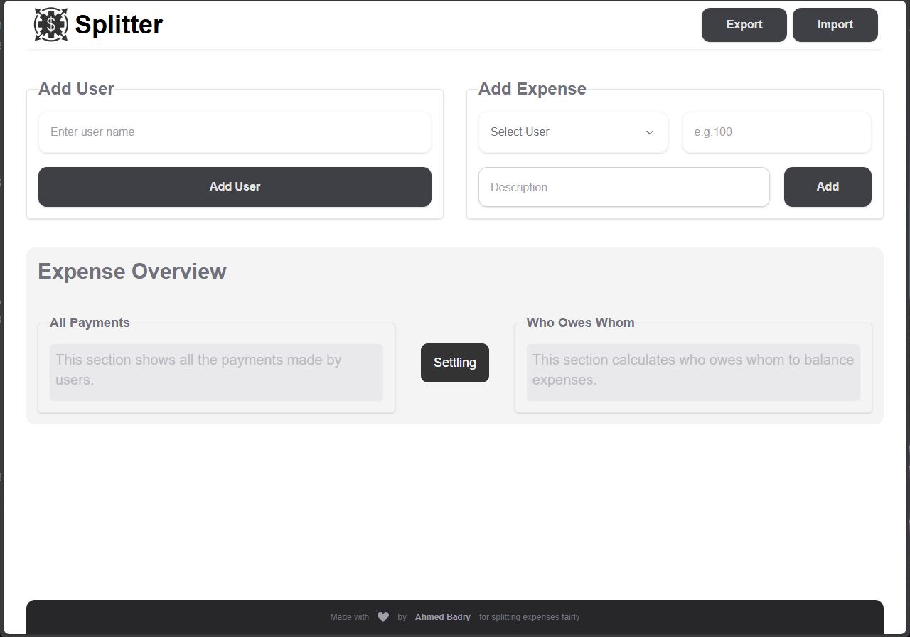
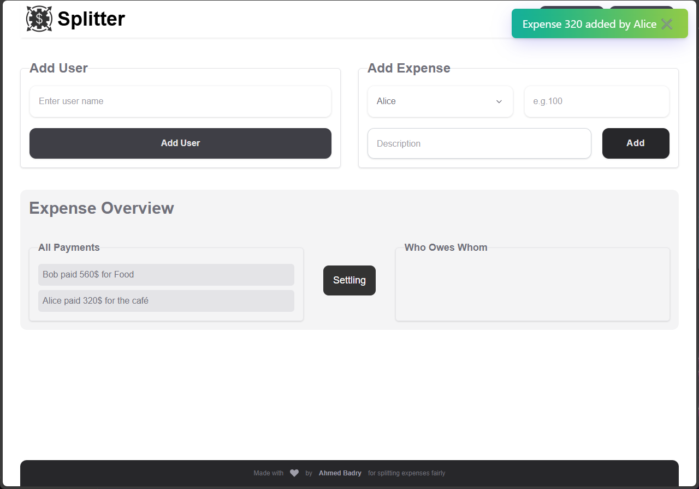
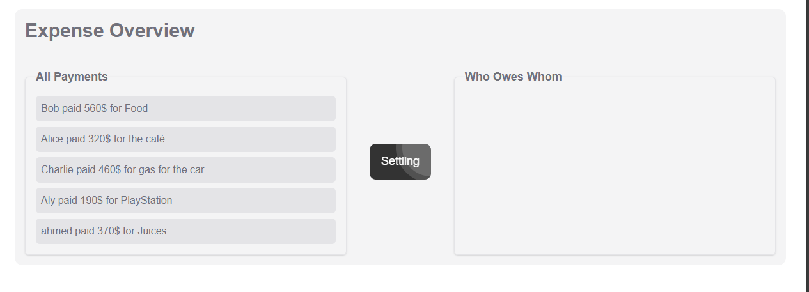
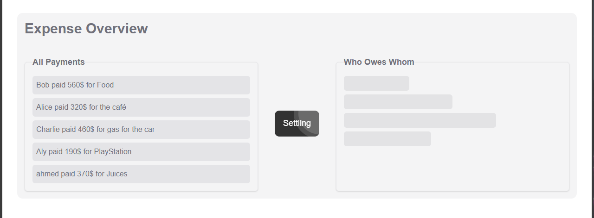
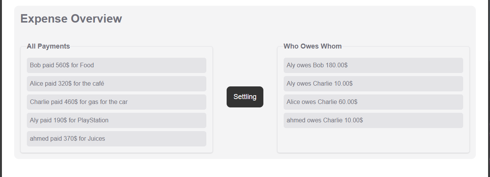

# Splitter App

Splitter App is a lightweight web application to help groups **track shared expenses** and automatically **calculate who owes whom**. It’s built with **TypeScript**, **Tailwind CSS**, and **Vite**, and uses a smart expense simplification algorithm to balance shared costs quickly and efficiently.

---

## 🚀 Features

### 👥 User Management

- Add new users
- View all users
- Remove users
- Prevent duplicates or invalid input

### 💸 Expense Tracking

- Record expenses with payer, amount, and description
- Display all payments in an organized list
- Validation to ensure only valid data is accepted

### 🧠 Expense Simplification

- Calculates each user’s share
- Computes net balances (who owes and who gets paid)
- Generates simplified settlements with “who owes whom” results

### 📊 UI Enhancements

- Smooth fade‑in animations using Tailwind
- Skeleton loading placeholders while processing results
- Toast notifications for success/error messages (using Toastify)
- Responsive and user‑friendly design

---

## 📸 Screenshots

```





```

---

## 🧩 How It Works

### 1. Add Users

Start by adding the names of all people involved in split expenses.  
Each added name becomes selectable when adding expenses.

### 2. Add Expenses

Select a user who paid, enter the amount and description, and submit.  
Expenses appear in the “All Payments” overview.

### 3. Simplify Expenses

Click the _Simplify_ button to calculate balances and generate settlement suggestions.  
The app computes who owes money and who should receive it.

---

## 🛠 Technology Stack

This project uses:

- **TypeScript** — for strong typing and maintainable logic
- **Vite** — fast build tool and dev server
- **Tailwind CSS** — utility‑first styling framework
- **Toastify** — for clean toast notifications

---

## 📦 Installation

To run the app locally:

1. **Clone the repository**

   ```bash
   git clone https://github.com/ahmedbadry-dev/Splitter-App.git
   cd Splitter-App
   ```

2. **Install dependencies**

   ```bash
   npm install
   ```

3. **Start the development server**

   ```bash
   npm run dev
   ```

4. Open your browser and go to:
   ```
   http://localhost:5173
   ```

---

## 📂 Project Structure

```
src/
├─ models/           # Expense & User class definitions
├─ services/         # Business logic for users and expenses
├─ ui/               # UI rendering and interaction logic
├─ helpers/          # DOM helpers and utilities
├─ main.ts           # App entry point
tailwind.config.js   # Tailwind configuration
vite.config.ts       # Vite configuration
```

---

## 🧠 Important Notes

✔ The app performs real‑time validation on user input.  
✔ Empty or invalid entries are prevented.  
✔ Each UI update is animated and responsive.  
✔ Expense Simplification uses a fair share algorithm.

---

## 🤝 Contributing

Contributions, bug reports, and feature requests are welcome!  
Feel free to create issues or pull requests.

---

## 📝 License

This project is open‑source and available under the **MIT License**.

---

## 🎉 Thanks for checking out Splitter App!

Build better shared expense tools ❤️
